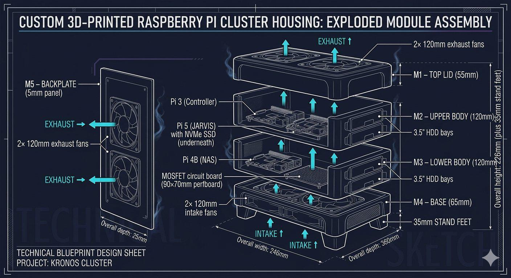
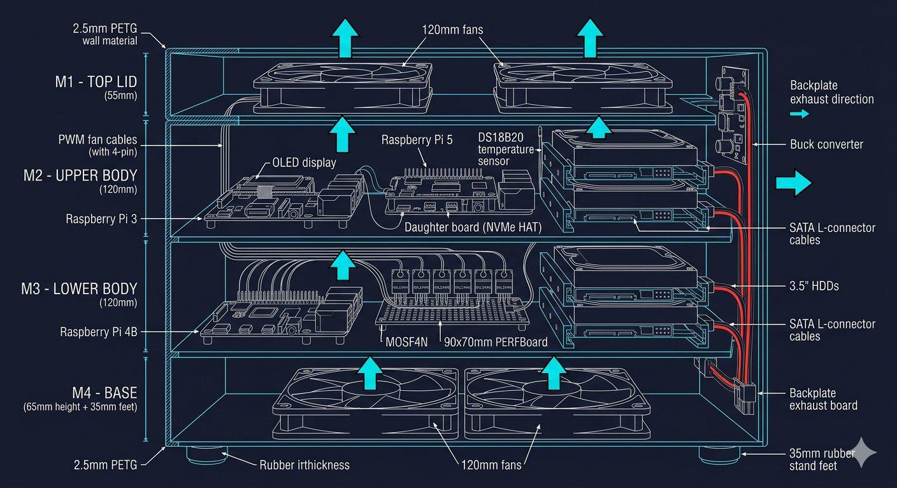

# 🛠️ Kronos Cluster - Modular 3D-Printed Raspberry Pi Cluster Enclosure

The **Kronos Cluster** is a custom-engineered, multi-module Raspberry Pi (3/4/5) server cluster node designed for localized edge computing, localized AI workloads, and network-attached storage (NAS). This repository contains the complete production-ready blueprints, technical schematics, wiring layouts, and 3D-printable housing architecture.

🔗 **Project Phase:** Blueprint & Hardware Engineering Specification (v4.2.1)

* Note: Structural blueprints and cross-sections were AI-assisted to conceptualize and visualize the technical specifications. The Final Design is subject to changes during the Design process

---

## 📐 Technical Architecture & Blueprints

### 1. Exploded View (Modular Assembly)
The enclosure features a strict 5-module vertical stack design (`M1` to `M5`), optimized for high mechanical stability and maintenance access.

### 2. Internal Cross-Section (Airflow & Power Routing)
Features an isolated thermal chamber for the integrated 500W ATX power supply in `M4` alongside a dynamic multi-zone PWM-driven airflow system for the processing units.

---

## ⚙️ Hardware Specifications & Compute Nodes

The cluster utilizes dedicated hardware profiles assigned to specific localized network roles

| Unit | Model | Core Functionality | Network Architecture |
| :--- | :--- | :--- | :--- |
| **Pi 3** | Raspberry Pi 3B/3B+ | Enclosure Infrastructure Controller (Temp, HW-PWM, OLED) | Local I2C / 1-Wire Control Bus |
| **Pi 5** | Raspberry Pi 5 (8GB) | "Kronos Core" (AI Processing, Home Assistant, PCIe NVMe) | Dedicated High-Speed Interface |
| **Pi 4B**| Raspberry Pi 4B (4/8GB)| Multi-Service Server Node (Gitea, SMTP, Private Cloud NAS)| Shared Gigabit Ethernet Link |

---

## 🛠️ Enclosure & Industrial Engineering

* **Modular Stacking (`M1` - `M5`):** The height of base module `M4` was specifically extended to 100mm to perfectly encapsulate a standardized 86mm high ATX PSU without sacrificing structural integrity.
* **Slide-In HDD Trays:** Dedicated 3.5" storage trays featuring integrated bottom guide rails, thumb-latches, and precise 2mm ventilation slots for continuous drive cooling.
* **Material Constraints:** Engineered entirely for **ASA** or **PETG** filaments (2.5mm wall thickness) to provide high thermal resistance and structural rigidity under full continuous load.
* **EMI & Cable Separation:** Power delivery routing channels are physically isolated from sensitive GPIO ribbon cables and network data links to prevent electromagnetic interference.

---

## ⚡ Power Delivery & Thermal Management

* **Centralized ATX Core:** A 500W 80+ Bronze ATX PSU provides high-amperage 12V lines directly to the 4x 3.5" HDDs and a central MOSFET array. A step-down buck converter (12V → 5.1V/3A) powers the Pi 3 and Pi 4B nodes.
* **Dedicated Pi 5 Rail:** To maintain official power specifications, the Pi 5 bypasses the internal ATX converter and is powered externally via the official 27W USB-C supply fed through the `M5` backplate.
* **Event-Driven PWM Control:** The Raspberry Pi 3 acts as the hardware supervisor, utilizing its hardware and software PWM pins to control an array of **6x Noctua PWM fans** based on real-time data from internal `DS18B20` 1-wire temperature sensors.

                   ┌──────────────────────────────┐
                   │   500W 80+ Bronze ATX PSU    │
                   └──────┬────────────────┬──────┘
                          │ 12V            │ 12V
                          ▼                ▼
      ┌───────────────────────┐        ┌─────────────────────────┐
      │ 12V→5.1V Buck Convert │        │ Custom 6x MOSFET Array  │
      └───────────┬───────────┘        └───────────┬─────────────┘
                  │ 5.1V                           │ PWM Speed Control
                  ▼                                ▼
      [Raspberry Pi 3 & 4B]              [6x Noctua PWM Fans]

---

## 🐾 Quality Assurance & Project Status

* **Project State:** Hardware specifications finalized; structural blueprints verified. Next phase involves physical filament printing and custom board soldering.
* **Official Quality Supervisor:** The build process is continuously peer-reviewed and field-tested by **Lucy (Certified Keyboard Inspector & Thermal Supervisor)**, ensuring proper hardware heat absorption and cable durability.

---

## 📈 Project Roadmap & Continuous Updates
This project is under active development. As the engineering phases progress, I will continuously update this repository with:
* **Changelogs & Iterations:** Documenting design adjustments, power distribution fine-tuning, and layout changes.
* **3D Printing Files:** Uploading production-ready STL/STEP files optimized for ASA/PETG filaments once physical tolerances are verified.
* **Source Code:** Adding the core custom software implementation (C++/Python/Bash) for the Pi 3 cluster control node and fan matrix management.

*Feel free to star the repository to follow the physical assembly and testing phase!*

## 📄 License
The underlying design concepts, diagrams, and hardware layouts are open for educational reference and custom structural modification. All software components are subject to open-source compliance.
 
